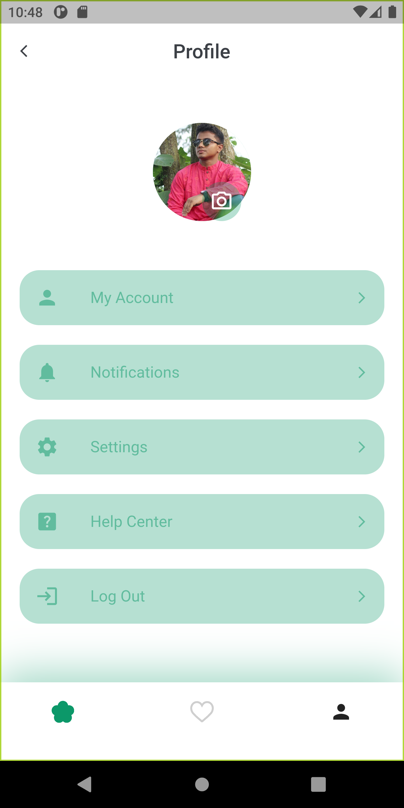

## App screen 




## Directory
```dart
lib
 |-- models
 |-- screens
 |   |-- splash_screen.dart 
 |   |-- home_screen.dart 
 |   |-- login_screen.dart 
 |   |-- singin_screen.dart 
 |   |-- home_screen.dart 
 |-- utils
 |   |-- apps_color.dart 
 |   |-- apps_color.dart 
 |-- widgets
 |-- main.dart 

```